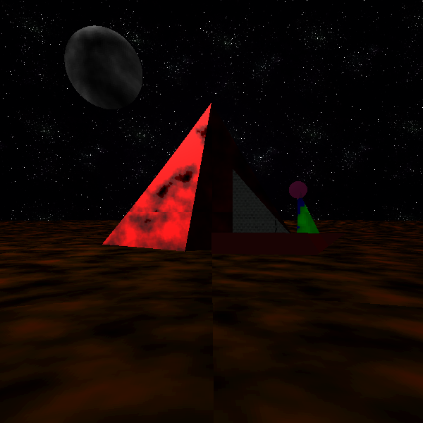
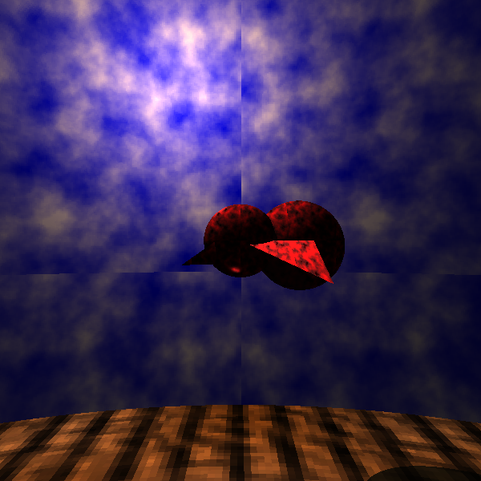
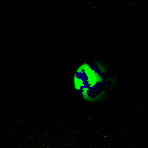
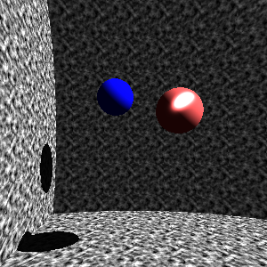
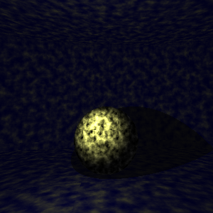
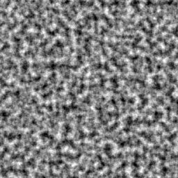
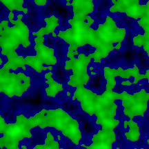
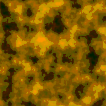
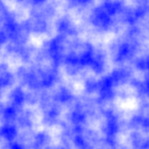

<h3>This Python raycasting implementation utilizes Perlin Noise algorithms for procedural texture generation and integrates Phong-Blinn shading models for complex surface lighting. 
  The codebase facilitates real-time scene rendering by tracing rays, simulating interactions with surfaces using Perlin Noise-generated textures, and accurately computing lighting effects through Phong-Blinn shading calculations. 
  This framework provides the ability explore spatial mappings, material representations, and illumination.</h3>

  <h3>Here are some examples!</h3>
   
  
  
  
  

  <h3>Here are some examples of generated Perlin Textures!</h3>
  
  
  
  

